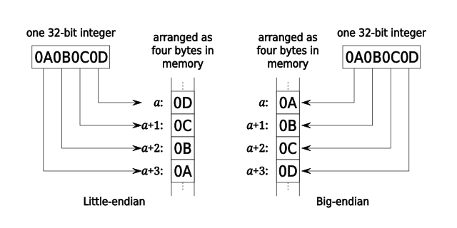

# chip8ish
Chip 8 interpreter written in C and probably more

## Tools

Right now I am using https://johnearnest.github.io/Octo/ to compile and decompile CHIP8 programs

## Progress So Far

Got just enough of an interpreter to load and execute a program that displays a little man on screen (using emoji because running in command line terminal)

14 October 2025 Update: And [IBM logo test](https://github.com/Timendus/chip8-test-suite):

## Source Documents and Notes

Using the following reference docs:
* https://en.wikipedia.org/wiki/CHIP-8
* http://devernay.free.fr/hacks/chip8/C8TECH10.HTM#0.1
* https://www.cs.columbia.edu/~sedwards/classes/2016/4840-spring/designs/Chip8.pdf
* https://johnearnest.github.io/Octo/docs/chip8ref.pdf

> The uppermost 256 bytes (0xF00-0xFFF) are reserved for display refresh, and the 96 bytes below that (0xEA0-0xEFF) were reserved for the call stack, internal use, and other variables.

> VF register doubles as a flag for some instructions; thus, it should be avoided. In an addition operation, VF is the carry flag, while in subtraction, it is the "no borrow" flag. In the draw instruction VF is set upon pixel collision.

> Three opcodes are used to detect input. One skips an instruction if a specific key is pressed, while another does the same if a specific key is not pressed. The third waits for a key press, and then stores it in one of the data registers.

>  sprites, which are 8 pixels wide and may be from 1 to 15 pixels in height. Sprite pixels are XOR'd with corresponding screen pixels. In other words, sprite pixels that are set flip the color of the corresponding screen pixel, while unset sprite pixels do nothing. The carry flag (VF) is set to 1 if any screen pixels are flipped from set to unset when a sprite is drawn and set to 0 otherwise. This is used for collision detection.

> CHIP-8 has 35 opcodes, which are all two bytes long and stored big-endian.

